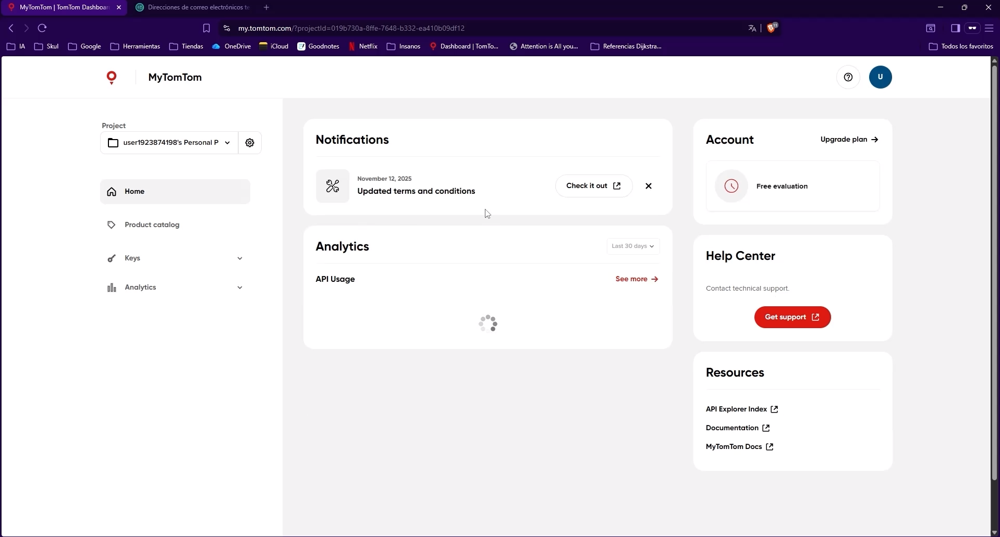
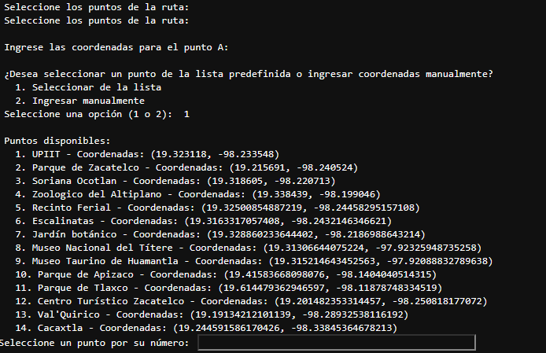
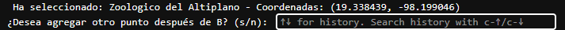
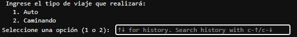

# Cálculo de Rutas Óptimas en Tlaxcala mediante Algoritmos de Búsqueda de Caminos

Este proyecto implementa y compara algoritmos de búsqueda de caminos óptimos (principalmente **Dijkstra** y **A\***), aplicados a la red vial del estado de Tlaxcala, con el objetivo de analizar su desempeño en términos de distancia, tiempo estimado y eficiencia computacional.

El desarrollo del proyecto se realizó en **Python**, utilizando **Jupyter Notebook** dentro del entorno **Anaconda**, y está pensado para ejecutarse **exclusivamente en Windows**.

---

## Requisitos indispensables

Antes de ejecutar el proyecto, es **obligatorio** contar con lo siguiente:

- **Sistema operativo:** Windows 10 u 11  
- **Anaconda (Python 3.x)**  
  - Incluye Jupyter Notebook y las bibliotecas necesarias para la ejecución del proyecto.

> **Nota:**   
> **Toda la ejecución se realiza desde Jupyter Notebook en Anaconda.**
> **Es necesario agregar la API de TOMTOM mediante una variable de entorno en Windows
   Para ello, se puede seguir el siguiente tutorial:

---

## Estructura del proyecto

Para mayor comodidad, es recomendable clonar el repositorio con 
git clone https://github.com/Gallebot/C-lculo-de-Rutas-ptimas-en-Tlaxcala-mediante-Algoritmos-de-B-squeda-de-Caminos

El archivo principal del proyecto es:

- `Cálculo-de-Rutas-óptimas-en-Tlaxcala-mediante-Algoritmos-de-Búsqueda-de-Caminos.ipynb`

Este notebook contiene:
- Carga y preparación de datos
- Implementación de los algoritmos
- Comparación de resultados
- Visualización de rutas y métricas

El archivo tlaxcala_drive.pkl permite tener precargado el mapa vial de Tlaxcala para una ejecución más rápida así como las carpetas de caché
---

## Ejecución del proyecto

Es necesario seguir estos pasos **en orden**:

1. Abre **Anaconda Navigator**.
2. Inicia **Jupyter Notebook**.
3. Navega hasta la carpeta donde se encuentra el archivo: Cálculo-de-Rutas-óptimas-en-Tlaxcala-mediante-Algoritmos-de-Búsqueda-de-Caminos.ipynb
4. Abre el archivo `.ipynb`.
5. Ejecuta las celdas **en orden**, usando:
- Los botones **Run** > **Run All Cells** de Jupyter Notebook.

---
## Ejecución

1. Se solicitarán las coordenadas del punto del que se desee partir.  
   Si se teclea `"2"` se pueden ingresar las coordenadas manualmente en el formato  
   **(19.323118, -98.233548)**.  
   Para mayor comodidad, se puede teclear `"1"` para utilizar un punto sugerido de la lista,
   ingresando su número correspondiente.

   

2. Una vez ingresado el punto de partida, se pregunta si se desea agregar otro punto.  
   Se teclea `"s"` para **Sí** y `"n"` para **No**.

   

3. En caso de seleccionar **Sí**, se solicitarán nuevamente las coordenadas.  
   Este proceso puede realizarse para cualquier número de puntos.  
   La única limitante son los tokens de la **TOMTOM API KEY**; como recomendación,
   **14 puntos** es el límite aproximado de los créditos disponibles en la versión gratuita.

4. Una vez que se selecciona que ya no se desean ingresar más puntos, se preguntará
   el tipo de viaje que se desea realizar:
   - Teclear `"1"` para elegir el viaje en **Auto**
   - Teclear `"2"` para elegir el viaje **Caminando**

   Para una ejecución más rápida, se importará automáticamente el archivo `.pkl`.

   

---
## Resultados

Al ejecutar el notebook se obtienen:
- Rutas óptimas calculadas con distintos algoritmos
- Comparaciones de distancia y tiempo
- Métricas de desempeño de cada algoritmo
- Visualizaciones sobre mapas

---

## Notas importantes

- El notebook está configurado para ejecutarse **sin modificaciones** en un entorno estándar de Anaconda.
- No se requiere conexión a servicios externos durante la ejecución.
- A mayor número de puntos, el tiempo de ejecución es mayor, por lo tanto, es importante tener paciencia al momento de la ejecución en caso de ejecutar los 14 puntos.
  

---
